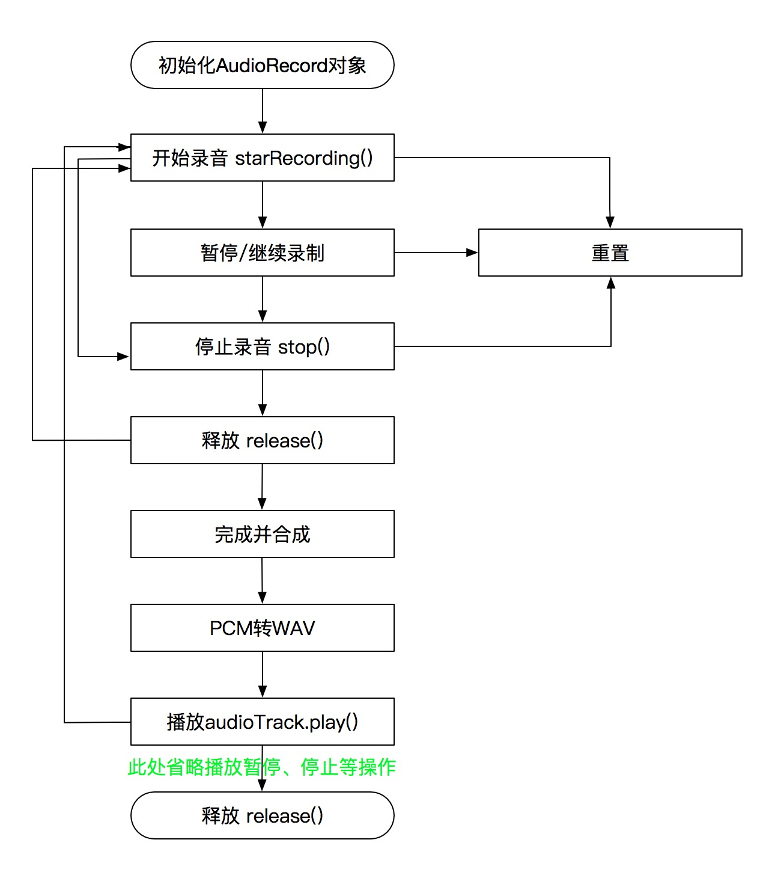

# audioapp

## File Info

1. `hwaudio`: App based on Android Studio

### Android Summary

#### 一、简述

    Android提供了两个API用于录音的实现：MediaRecorder 和AudioRecord。

    1、MediaRecorder：录制的音频文件是经过压缩后的，需要设置编码器。并且录制的音频文件可以用系统自带的Music播放器播放。MediaRecorder已经集成了录音、编码、压缩等，并支持少量的录音音频格式，但是这也是他的缺点，支持的格式过少并且无法实时处理音频数据。

    2、AudioRecord：主要实现对音频实时处理以及边录边播功能，相对MediaRecorder比较专业，输出是PCM语音数据，如果保存成音频文件，是不能够被播放器播放的，所以必须先写代码实现数据编码以及压缩。

#### MediaRecorder

    MediaRecorder因为已经集成了录音、编码、压缩等功能，所以使用起来相对比较简单。

    具体关于MediaRecorder的介绍，可以参考这里

    [Android 录音实现（MediaRecorder）](https://www.jianshu.com/p/de779d509e6c)

    [Android 录音实现（AudioRecord）](https://www.jianshu.com/p/90c4071c7768)

#### 二、效果

#### 三、权限

    <!-- 录音 -->
    <uses-permission android:name="android.permission.RECORD_AUDIO"/>
    <!--播音-->
    <uses-permission android:name="android.permission.WAKE_LOCK"/>

#### 四、使用

##### 1、常规设置

##### 1) 设置最大时长

    //默认时长60秒
    AudioRecordManager.getInstance(this).setMaxVoiceDuration(120);

##### 2) 设置语音位置

    //该库内不对文件夹是否存在进行判断，所以请在你的项目中自行判断
    mAudioDir = new File(Environment.getExternalStorageDirectory(), "LQR_AUDIO");
    if (!mAudioDir.exists()) {
        mAudioDir.mkdirs();
    }

    AudioRecordManager.getInstance(this).setAudioSavePath(mAudioDir.getAbsolutePath());

##### 2、录音

录音使用的是 AudioRecordManager 类。

##### 1) 基本方法

    //开始录音
    AudioRecordManager.getInstance(MainActivity.this).startRecord();

    //将要取消录音（参与微信手指上滑）
    AudioRecordManager.getInstance(MainActivity.this).willCancelRecord();

    //继续录音（参与微信手指上滑后加下滑回到原位）
    AudioRecordManager.getInstance(MainActivity.this).continueRecord();

    //停止录音
    AudioRecordManager.getInstance(MainActivity.this).stopRecord();

    //销毁录音
    AudioRecordManager.getInstance(MainActivity.this).destroyRecord();

##### 2) 录音监听

该库提供IAudioRecordListener接口，方便用户对录音中不同事件进行处理，具体使用请参考DEMO代码（代码较多，请根据自己的项目修改），接口描述：

    public interface IAudioRecordListener {

        /**
            * 初始化提示视图
            */
        void initTipView();

        /**
            * 设置倒计时提示视图
            *
            * @param counter 10秒倒计时
            */
        void setTimeoutTipView(int counter);

        /**
            * 设置正在录制提示视图
            */
        void setRecordingTipView();

        /**
            * 设置语音长度太短提示视图
            */
        void setAudioShortTipView();

        /**
            * 设置取消提示视图
            */
        void setCancelTipView();

        /**
            * 销毁提示视图
            */
        void destroyTipView();

        /**
            * 开始录制
            * 如果是做IM的话，这里可以发送一个消息，如：对方正在讲话
            */
        void onStartRecord();

        /**
            * 录制结束
            *
            * @param audioPath 语音文件路径
            * @param duration  语音文件时长
            */
        void onFinish(Uri audioPath, int duration);

        /**
            * 分贝改变
            *
            * @param db 分贝
            */
        void onAudioDBChanged(int db);

    }

##### 2、播音

播音使用的是 AudioPlayManager 类。

##### 1) 开始播放

    AudioPlayManager.getInstance().startPlay(MainActivity.this, audioUri, new IAudioPlayListener() {
        @Override
        public void onStart(Uri var1) {
            //开播（一般是开始语音消息动画）
        }

        @Override
        public void onStop(Uri var1) {
            //停播（一般是停止语音消息动画）
        }

        @Override
        public void onComplete(Uri var1) {
            //播完（一般是停止语音消息动画）
        }
    });

##### 2) 结束播放

    AudioPlayManager.getInstance().stopPlay();

AudioRecord + AudioTrack + AudioFormat，通过pcm文件合并并转wav实现录音、暂停、播放、停止、重录、计时等功能

[官方文档地址](https://developer.android.google.cn/reference/android/media/AudioRecord)：https://developer.android.google.cn/reference/android/media/AudioRecord

### 1、简单对比

AudioRecord和MediaRecorder两种都可以录制音频，MediaRecorder基于文件录音，系统已实现大量的封装，集成了录音、编码、压缩等，支持少量的音频格式文件，操作起来更加简单，而AudioRecord基于字节流录音，AudioTrack更接近底层，使用起来更加灵活，能实现更多的功能。因为考虑到需要对音频进行一系列处理，所以嘛，最后选择了AudioRecord。如下是简单的对比：

### [AudioRecord](#)

`优点`：可以实现语音的实时处理，进行边录边播，对音频的实时处理，AudioTrack更接近底层。

`缺点`：输出的是PCM的语音数据，如果保存成音频文件是不能被播放器播放的，需要用AudioTrack来播放。API还有待完善，常见的暂停功能都不支持。

### [MediaRecorder](#)
 
`优点`：系统封装的完整，直接调用即可，操作简单，录制的音频文件可以用系统自带的播放器播放。

`缺点`：无法实现实时处理音频，输出的音频格式少。录制的音频文件是经过压缩后的，需要设置编码器。

***

### 2、专业名词说明

#### 采样率

- 采样率：采样率即采样频率，指每秒钟取得声音样本的次数，采样频率越高，能表现的频率范围就越大，音质就会越好，声音的还原度也更真实，但此同时带来的弊端是占有的内存资源也会越大。因为人耳的分辨率有限，并不是频率越高越好，44KHz已相当于CD音质了，目前的常用采样频率都不超过48KHz。

#### 声道

- 声道：这个好理解，生活中也经常听到单声道、双声道等，在Android系统中，可以通过设置音频的录制的声道CHANNEL_IN_STEREO为双声道，CHANNEL_CONFIGURATION_MONO为单声道，双声道音质更加，但同样伴随着内存资源消耗更大的弊端。

#### 采样位深

- 采样位深：位深度也叫采样位深，音频的位深度决定动态范围，它是用来衡量声音波动变化的一个参数，也可以说是声卡的分辨率。它的数值越大，分辨率也就越高，所发出声音的能力越强。在计算机中采样位数一般有8位和16位之分，即分成2的8次方和2的16次方之分，PCM 16位每个样本，保证设备支持。PCM 8位每个样本，不一定能得到设备支持。

#### 构造函数

```java
public AudioRecord(int audioSource, int sampleRateInHz, int channelConfig, int audioFormat,
            int bufferSizeInBytes)
```

`audioSource`：录音源，指定声音是从哪里录制的，[官网文档参考戳此](https://developer.android.google.cn/reference/android/media/MediaRecorder.AudioSource)

`sampleRateInHz`：采样率

`channelConfig`：声道数

`audioFormat`：采样位深

`bufferSizeInBytes`：最小缓冲大小，可以通过getMinBufferSize获取。

#### 补充

`补充`：存储量= 采样率 * 采样时间 * 采样位深 / 8 * 声道数（Bytes）。以采样率为44.1kHZ、采样位深为16位、双声道计算，一分钟消耗的内存为10.335M。

***

### 3、实现流程

#### 流程图



#### 初始化AudioRecord对象

```java
    /**
     * 创建默认的录音对象
     *
     * @param fileName 文件名
     */
    public void createDefaultAudio(String fileName) {
        // 获得缓冲区字节大小
        bufferSizeInBytes = AudioRecord.getMinBufferSize(AUDIO_SAMPLE_RATE, AUDIO_CHANNEL, AUDIO_ENCODING);
        audioRecord = new AudioRecord(AUDIO_INPUT, AUDIO_SAMPLE_RATE, AUDIO_CHANNEL, AUDIO_ENCODING, bufferSizeInBytes);
        this.fileName = fileName;
        status = AudioStatus.STATUS_READY;

        AudioAttributes audioAttributes = new AudioAttributes.Builder().setUsage(AudioAttributes.USAGE_MEDIA)
                .setContentType(AudioAttributes.CONTENT_TYPE_MUSIC).build();

        AudioFormat audioFormat = new AudioFormat.Builder().setSampleRate(AUDIO_SAMPLE_RATE)
                .setEncoding(AUDIO_ENCODING).setChannelMask(AudioFormat.CHANNEL_OUT_MONO).build();

        audioTrack = new AudioTrack(audioAttributes, audioFormat, bufferSizeInBytes,
                AudioTrack.MODE_STREAM, AudioManager.AUDIO_SESSION_ID_GENERATE);
    }
```

以上参数已经介绍完，此处不做多余解释。

#### 开始录音

```java
    /**
     * 开始录音
     */
    public void startRecord() {
        if (status == AudioStatus.STATUS_NO_READY || TextUtils.isEmpty(fileName)) {
            throw new IllegalStateException("请检查录音权限");
        }
        if (status == AudioStatus.STATUS_START) {
            throw new IllegalStateException("正在录音");
        }
        audioRecord.startRecording();
        cachedThreadPool.execute(new Runnable() {
            @Override
            public void run() {
                writeDataTOFile();
            }
        });
    }
```

```java
    /**
     * 将音频信息写入文件
     */
    private void writeDataTOFile() {
        // new一个byte数组用来存一些字节数据，大小为缓冲区大小
        byte[] audioData = new byte[bufferSizeInBytes];
        FileOutputStream fos = null;
        int readSize = 0;
        try {
            String currentFileName = fileName;
            if (status == AudioStatus.STATUS_PAUSE) {
                //假如是暂停录音 将文件名后面加个数字,防止重名文件内容被覆盖
                currentFileName += filesName.size();
            }
            filesName.add(currentFileName);
            File file = new File(FileUtils.getPcmFileAbsolutePath(currentFileName));
            if (file.exists()) {
                file.delete();
            }
            // 建立一个可存取字节的文件
            fos = new FileOutputStream(file);
        } catch (IllegalStateException e) {
            e.printStackTrace();
            throw new IllegalStateException(e.getMessage());
        } catch (FileNotFoundException e) {
            e.printStackTrace();
        }
        //将录音状态设置成正在录音状态
        status = AudioStatus.STATUS_START;
        while (status == AudioStatus.STATUS_START) {
            readSize = audioRecord.read(audioData, 0, bufferSizeInBytes);
            if (AudioRecord.ERROR_INVALID_OPERATION != readSize && fos != null) {
                try {
                    fos.write(audioData);
                } catch (IOException e) {
                    e.printStackTrace();
                }
            }
        }
        try {
            if (fos != null) {
                fos.close();// 关闭写入流
            }
        } catch (IOException e) {
            e.printStackTrace();
        }
    }
```

#### 暂停/继续录制

```java
    /**
     * 暂停录音
     */
    public void pauseRecord() {
        if (status != AudioStatus.STATUS_START) {
            throw new IllegalStateException("没有在录音");
        } else {
            audioRecord.stop();
            status = AudioStatus.STATUS_PAUSE;
        }
    }
```

`说明：`为啥说好的是暂停，此处确实停止？上文也曾提到过，AudioRecord没有提供暂停的API，目前所实现的的暂停，就是不断的使用停止和再次录制，形成多个文件，然后在合并成一个文件并转码成wav，最终形成 AudioFormat 可读取的文件，以此来达到暂停和在录制的功能。

#### 停止录音

```java
    /**
     * 停止录音
     */
    public void stopRecord() {
        if (status == AudioStatus.STATUS_NO_READY || status == AudioStatus.STATUS_READY) {
            throw new IllegalStateException("录音尚未开始");
        } else {
            audioRecord.stop();
            status = AudioStatus.STATUS_STOP;
            release();
        }
    }
```

执行此方法后，便赋值给status，以此来改变状态。

#### 释放资源

```java
    /**
     * 释放资源
     */
    public void release() {
        //假如有暂停录音
        try {
            if (filesName.size() > 0) {
                List<String> filePaths = new ArrayList<>();
                for (String fileName : filesName) {
                    filePaths.add(FileUtils.getPcmFileAbsolutePath(fileName));
                }
                //清除
                filesName.clear();
                if (isReset) {
                    isReset = false;
                    FileUtils.clearFiles(filePaths);
                } else {
                    //将多个pcm文件转化为wav文件
                    pcmFilesToWavFile(filePaths);
                }
            }
        } catch (IllegalStateException e) {
            throw new IllegalStateException(e.getMessage());
        }

        if (audioRecord != null) {
            audioRecord.release();
            audioRecord = null;
        }
        status = AudioStatus.STATUS_NO_READY;
    }
```

#### 完成、合成、转码

```java
/**
 * Created by ZhouMeng on 2018/8/31.
 * 将pcm文件转化为wav文件
 * pcm是无损wav文件中音频数据的一种编码方式，pcm加上wav文件头就可以转为wav格式，但wav还可以用其它方式编码。
 * 此类就是通过给pcm加上wav的文件头，来转为wav格式
 */
public class PcmToWav {
    /**
     * 合并多个pcm文件为一个wav文件
     * @param filePathList    pcm文件路径集合
     * @param destinationPath 目标wav文件路径
     * @return true|false
     */
    public static boolean mergePCMFilesToWAVFile(List<String> filePathList, String destinationPath) {
        File[] file = new File[filePathList.size()];
        byte buffer[] = null;

        int TOTAL_SIZE = 0;
        int fileNum = filePathList.size();

        for (int i = 0; i < fileNum; i++) {
            file[i] = new File(filePathList.get(i));
            TOTAL_SIZE += file[i].length();
        }

        // 填入参数，比特率等等。这里用的是16位单声道 8000 hz
        WaveHeader header = new WaveHeader();
        // 长度字段 = 内容的大小（TOTAL_SIZE) + 头部字段的大小(不包括前面4字节的标识符RIFF以及fileLength本身的4字节)
        header.fileLength = TOTAL_SIZE + (44 - 8);
        header.FmtHdrLeth = 16;
        header.BitsPerSample = 16;
        header.Channels = 2;
        header.FormatTag = 0x0001;
        header.SamplesPerSec = 8000;
        header.BlockAlign = (short) (header.Channels * header.BitsPerSample / 8);
        header.AvgBytesPerSec = header.BlockAlign * header.SamplesPerSec;
        header.DataHdrLeth = TOTAL_SIZE;

        byte[] h = null;
        try {
            h = header.getHeader();
        } catch (IOException e1) {
            Log.e("PcmToWav", e1.getMessage());
            return false;
        }

        // WAV标准，头部应该是44字节,如果不是44个字节则不进行转换文件
        if (h.length != 44) {
            return false;
        }

        //先删除目标文件
        File destFile = new File(destinationPath);
        if (destFile.exists()) {
            destFile.delete();
        }

        //合成所有的pcm文件的数据，写到目标文件
        try {
            buffer = new byte[1024 * 4]; // Length of All Files, Total Size
            InputStream inStream = null;
            OutputStream ouStream = null;

            ouStream = new BufferedOutputStream(new FileOutputStream(
                    destinationPath));
            ouStream.write(h, 0, h.length);
            for (int j = 0; j < fileNum; j++) {
                inStream = new BufferedInputStream(new FileInputStream(file[j]));
                int size = inStream.read(buffer);
                while (size != -1) {
                    ouStream.write(buffer);
                    size = inStream.read(buffer);
                }
                inStream.close();
            }
            ouStream.close();
        } catch (IOException ioe) {
            ioe.getMessage();
            return false;
        }
        FileUtils.clearFiles(filePathList);
//        File wavFile = new File(new File(destinationPath).getParent());
//        if (wavFile.exists()) {
//            FileUtils.deleteFile(wavFile);
//        }

        return true;
    }
}
```

```java
/**
 * Created by ZhouMeng on 2018/8/31.
 * wav文件头
 */
public class WaveHeader {
    public final char fileID[] = {'R', 'I', 'F', 'F'};
    public int fileLength;
    public char wavTag[] = {'W', 'A', 'V', 'E'};
    public char FmtHdrID[] = {'f', 'm', 't', ' '};
    public int FmtHdrLeth;
    public short FormatTag;
    public short Channels;
    public int SamplesPerSec;
    public int AvgBytesPerSec;
    public short BlockAlign;
    public short BitsPerSample;
    public char DataHdrID[] = {'d','a','t','a'};
    public int DataHdrLeth;

    public byte[] getHeader() throws IOException {
        ByteArrayOutputStream bos = new ByteArrayOutputStream();
        WriteChar(bos, fileID);
        WriteInt(bos, fileLength);
        WriteChar(bos, wavTag);
        WriteChar(bos, FmtHdrID);
        WriteInt(bos,FmtHdrLeth);
        WriteShort(bos,FormatTag);
        WriteShort(bos,Channels);
        WriteInt(bos,SamplesPerSec);
        WriteInt(bos,AvgBytesPerSec);
        WriteShort(bos,BlockAlign);
        WriteShort(bos,BitsPerSample);
        WriteChar(bos,DataHdrID);
        WriteInt(bos,DataHdrLeth);
        bos.flush();
        byte[] r = bos.toByteArray();
        bos.close();
        return r;
    }

    private void WriteShort(ByteArrayOutputStream bos, int s) throws IOException {
        byte[] myByte = new byte[2];
        myByte[1] =(byte)( (s << 16) >> 24 );
        myByte[0] =(byte)( (s << 24) >> 24 );
        bos.write(myByte);
    }

    private void WriteInt(ByteArrayOutputStream bos, int n) throws IOException {
        byte[] buf = new byte[4];
        buf[3] =(byte)( n >> 24 );
        buf[2] =(byte)( (n << 8) >> 24 );
        buf[1] =(byte)( (n << 16) >> 24 );
        buf[0] =(byte)( (n << 24) >> 24 );
        bos.write(buf);
    }

    private void WriteChar(ByteArrayOutputStream bos, char[] id) {
        for (char c : id) {
            bos.write(c);
        }
    }
}
```

> 4字节数据，内容为“RIFF”，表示资源交换文件标识
> 4字节数据，内容为一个整数，表示从下个地址开始到文件尾的总字节数
> 4字节数据，内容为“WAVE”，表示WAV文件标识
> 4字节数据，内容为“fmt ”，表示波形格式标识（fmt ），最后一位空格。
> 4字节数据，内容为一个整数，表示PCMWAVEFORMAT的长度
> 2字节数据，内容为一个短整数，表示格式种类（值为1时，表示数据为线性PCM编码）
> 2字节数据，内容为一个短整数，表示通道数，单声道为1，双声道为2
> 4字节数据，内容为一个整数，表示采样率，比如44100
> 4字节数据，内容为一个整数，表示波形数据传输速率（每秒平均字节数），大小为 采样率 * 通道数 * 采样位深
> 2字节数据，内容为一个短整数，表示DATA数据块长度，大小为 通道数 * 采样位深
> 2字节数据，内容为一个短整数，表示采样位数，即PCM位宽，通常为8位或16位
> 4字节数据，内容为“data”，表示数据标记符
> 4字节数据，内容为一个整数，表示接下来声音数据的总大小

#### 播放

```java
    /**
     * 播放合成后的wav文件
     *
     * @param filePath 文件的绝对路径
     */
    public void play(final String filePath) {
        audioTrack.play();

        cachedThreadPool.execute(new Runnable() {

            @Override
            public void run() {
                File file = new File(filePath);
                FileInputStream fis = null;
                try {
                    fis = new FileInputStream(file);
                } catch (FileNotFoundException e) {
                    e.printStackTrace();
                }
                byte[] buffer = new byte[bufferSizeInBytes];
                while (fis != null) {
                    try {
                        int readCount = fis.read(buffer);
                        if (readCount == AudioTrack.ERROR_INVALID_OPERATION || readCount == AudioTrack.ERROR_BAD_VALUE) {
                            continue;
                        }
                        if (readCount != 0 && readCount != -1) {
                            audioTrack.write(buffer, 0, readCount);
                        }
                    } catch (IOException e) {
                        e.printStackTrace();
                    }
                }
            }
        });
    }
```

#### 释放资源

```java
    /**
     * 释放audioTrack
     */
    public void releaseAudioTrack(){
        if (audioTrack == null) {
            return;
        }
        if (audioTrack.getPlayState() != AudioTrack.PLAYSTATE_STOPPED) {
            audioTrack.stop();
        }
        audioTrack.release();
        audioTrack = null;
    }
```

此处释放的资源，主要是audioTrack对象，在这之前已经释放过一次资源，上一次释放的为audioRecord对象相关。

#### 重置

```java
    /**
     * 重置，删除所有的pcm文件
     */
    private boolean isReset = false;

    public void setReset() {
        isReset = true;
    }
```

主要通过设置 isReset 参数来实现重置，此操作就是执行停止的操作，在停止的过程中做判断，把录制好的文件都删除，不在走合并和转码的过程，以此来达到重置的效果。